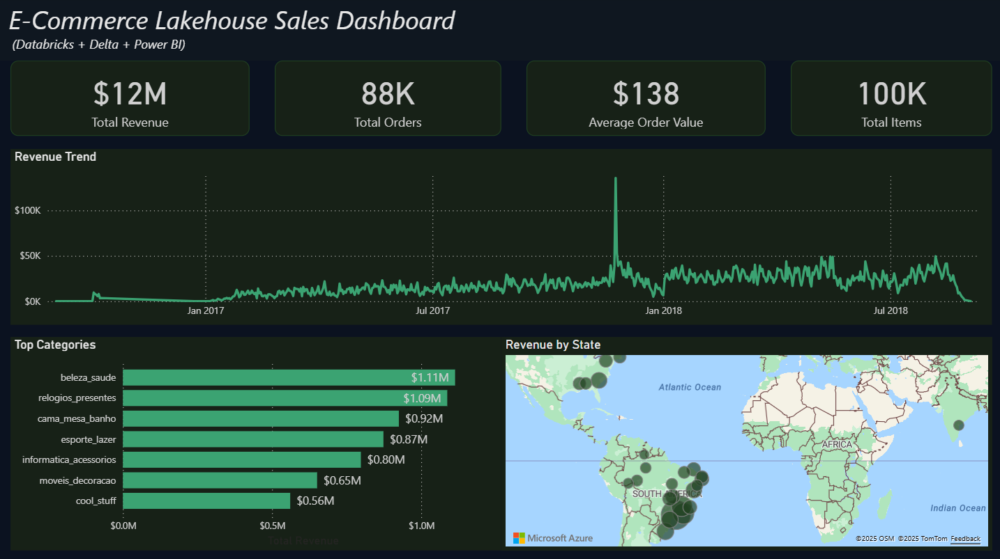

# Retail Lakehouse (Databricks + Delta)

## Overview

Medallion architecture (Bronze -> Silver -> Gold) on Delta Lake using a public e-commerce dataset.

## Stack

- Databricks Community Edition
- Delta Lake
- Power BI

## Repo Structure

- /data                Raw CSVs (optional reference)
- /notebooks           Databricks notebooks (Bronze/Silver/Gold)
- /notebooks/sql       SQL used inside notebooks
- /sql                 Gold views, ad-hoc queries
- /docs                Diagrams and screenshots

## How to Run

1) Upload CSVs to DBFS (`/FileStore/retail/*.csv`)
2) Run `01_bronze_ingest.py`
3) Run `02_silver_conform.py`
4) Run `03_gold_marts.py`
5) Connect BI tool to Gold tables

## Diagrams

See docs/architecture.png

## Dataset

Use a public e-commerce dataset (Olist). Place CSVs in `/FileStore/retail/`.

## Results

Built a working **Bronze → Silver → Gold Lakehouse** in Databricks CE using the Olist E-commerce dataset.

- **Bronze**: Raw CSVs → Delta (`orders_raw`, `order_items_raw`, `customers_raw`, `products_raw`, `payments_raw`)
- **Silver**: Cleaned & conformed tables with typed columns, deduplication, null handling
- **Gold**: Star schema with `f_sales` fact + dimensions (`d_customer`, `d_product`, `d_calendar`)
- **Views**: `vw_sales_enriched` (fact + dims) and `vw_sales_daily` (daily revenue/freight aggregates)

## Power BI Dashboard
This project concludes with a business-facing dashboard built in Power BI, highlighting revenue trends, top categories, and geographic distribution.

See [docs/RESULTS.md](./docs/RESULTS.md) for details, queries, and visualizations.

## Next

- Add data quality checks (row counts, null % thresholds)
- Optional: Airflow DAG to sequence Bronze → Silver → Gold
- Visuals: Power BI Desktop report (daily revenue, top categories)
