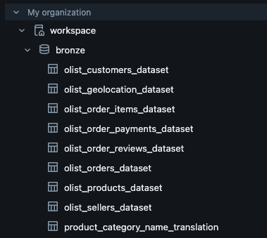
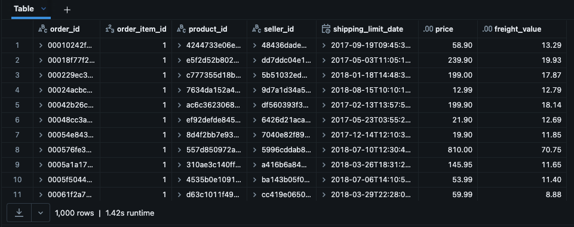
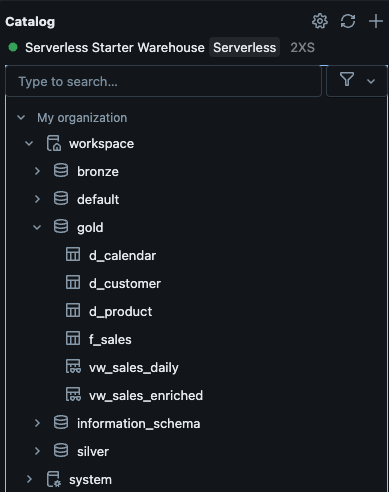

# Results – Retail Lakehouse (Databricks + Delta)

## Overview

This document captures the validation, queries, and screenshots from the end-to-end **Bronze → Silver → Gold** pipeline for the Olist E-commerce dataset.
The goal: demonstrate a working **medallion architecture** in Databricks CE with BI-ready outputs.

---

## 1. Bronze Layer

- Raw CSVs ingested into **`bronze`** database as Delta tables:
  - `orders_raw`
  - `order_items_raw`
  - `customers_raw`
  - `products_raw`
  - `payments_raw`

**Bronze Delta tables:**



---

## 2. Silver Layer

- Cleaned & conformed tables in **`silver`** database:
  - Typed columns (timestamps, decimals)
  - Deduplicated by primary keys
  - Nulls handled
- Tables: `orders`, `order_items`, `customers`, `products`, `payments`

**Row Counts (sample):**

| Table            | Rows   |
| ---------------- | ------ |
| silver.orders    | 99,441 |
| silver.customers | 99,444 |
| silver.products  | 3,700  |

**Screenshot:**


---

## 3. Gold Layer

- **Dimensions:**
  - `d_customer` (city, state)
  - `d_product` (category, attributes)
  - `d_calendar` (date, year, month, dow)
- **Fact Table:**
  - `f_sales` (grain = order_id + item_id)

**Gold Delta tables:**


---

## 4. Views

- **`vw_sales_enriched`** → fact + dimensions joined
- **`vw_sales_daily`** → aggregated revenue/freight by date, state, product category

**Sample Query – Top Categories by Revenue:**

```sql
SELECT
  product_category_name
, SUM(item_price) AS revenue
FROM gold.vw_sales_enriched
GROUP BY product_category_name
ORDER BY revenue DESC
LIMIT 10;
```


---


## 5. Data Quality & Sanity Checks

- Verified date range: `2016-09-04` → `2018-10-17`
- Fact rows: ~112,650
- Total revenue: ~R$ 16.3M
- No missing product joins (0 FK violations)

**Validation Queries:**

```sql
-- Row counts
SELECT 'f_sales' AS tbl, COUNT(*) AS rows FROM gold.f_sales
UNION ALL SELECT 'd_customer', COUNT(*) FROM gold.d_customer
UNION ALL SELECT 'd_product',  COUNT(*) FROM gold.d_product
UNION ALL SELECT 'd_calendar', COUNT(*) FROM gold.d_calendar;

-- Null FK diagnostics
SELECT COUNT(*) AS null_customer_in_fact
FROM gold.f_sales
WHERE customer_id IS NULL;

SELECT COUNT(*) AS missing_product_dim
FROM gold.f_sales f
LEFT JOIN gold.d_product p ON p.product_id = f.product_id
WHERE p.product_id IS NULL;

-- Basic reasonableness checks
SELECT
  MIN(order_date) AS min_date
, MAX(order_date) AS max_date
, COUNT(*)        AS fact_rows
, SUM(item_price) AS total_revenue
, SUM(freight)    AS total_freight
FROM gold.f_sales;

-- Top 10 product categories by revenue
SELECT
  product_category_name
, SUM(item_price) AS revenue
FROM gold.vw_sales_enriched
GROUP BY product_category_name
ORDER BY revenue DESC
LIMIT 10;

-- Revenue by state & day
SELECT
  order_date
, customer_state
, SUM(item_price) AS revenue
FROM gold.vw_sales_enriched
GROUP BY order_date, customer_state
ORDER BY order_date, revenue DESC
LIMIT 200;

```

---

## 6. Visualizations

- **Daily Revenue Trend** (from `vw_sales_daily`)
- **Revenue by State** (geo heatmap)
- **Top Categories** (bar chart)

**Screenshot:**


---

## 7. Next Steps

- Add **data quality tests** with Great Expectations or dbt
- Orchestrate **Bronze → Silver → Gold** with an Airflow DAG
- Build out a **Power BI report** with 3–5 visuals for portfolio screenshots

---

## References

- Dataset: [Kaggle – Brazilian E-Commerce Public Dataset by Olist](https://www.kaggle.com/datasets/olistbr/brazilian-ecommerce)
- Architecture diagram: [docs/architecture.png](./architecture.png)
